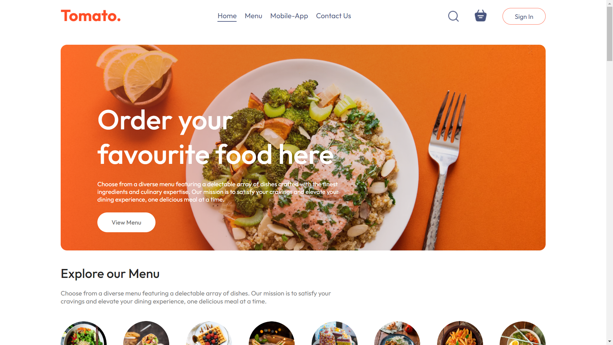

# 🍅 Tomato - Food Delivery Application

Welcome to Tomato, your go-to food delivery app! 🚀

## 🌟 Features

- 🍕 Browse a variety of delicious foods
- 🛒 Add items to your cart with ease
- 🔍 Search for your favorite dishes

## 🛠️ Tech Stack

- **Frontend:**
  - React.js ⚛️
  - Redux 🗃️
  - Tailwind CSS 🎨

- **Deployment:**
  - Vercel ▲

## 🚀 Getting Started

1. **Clone the repository:**

   ```bash
   git clone https://github.com/Smit2912/foodDelivery.git
   ```

2. **Navigate to the project directory:**

   ```bash
   cd foodDelivery
   ```

3. **Install dependencies:**

   ```bash
   npm install
   ```

4. **Start the development server:**

   ```bash
   npm start
   ```

## 📸 Screenshots

### Home Page


## 🤝 Contributing

We welcome contributions! Here's how you can help:

1. Fork the repository 🍴
2. Create a new branch: `git checkout -b my-feature` 🌿
3. Make your changes and commit: `git commit -m 'Add new feature'` 💬
4. Push to the branch: `git push origin my-feature` 🚀
5. Submit a pull request 📬

## 📞 Contact

Feel free to reach out if you have any questions or suggestions:

- Email: [smitsoni2912@gmail.com](mailto:smitsoni2912@gmail.com)
- LinkedIn: [Smit Soni](https://www.linkedin.com/in/smitsoni29/)

---

Enjoy using Tomato! 🍅🚀
